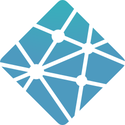
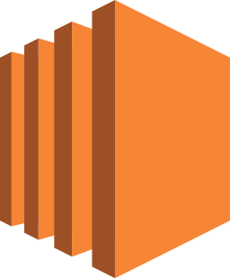

## Hi there, I'm Lexy!</img>

- 🌱 I’m currently learning Typescript
-  🔭 I’m currently working on [kanboro](https://github.com/lexykio/kanboro)
##

 

<!--
**lexykio/lexykio** is a ✨ _special_ ✨ repository because its `README.md` (this file) appears on your GitHub profile.
Here are some ideas to get you started:

- 🔭 I’m currently working on [tabletop tracker](https://github.com/lexykio/tabletop-tracker) & [cat diaries](https://github.com/lexykio/cat-diaries)

##

&nbsp;&nbsp;

 
 

&nbsp;&nbsp;

&nbsp;&nbsp;

 
- 📫 How to reach me: [linkedin](https://www.linkedin.com/in/lexyk/)
- 🔭 I’m currently working on ...
- 🌱 I’m currently learning ...
- 👯 I’m looking to collaborate on ...
- 🤔 I’m looking for help with ...
- 💬 Ask me about ...
- 📫 How to reach me: ...
- 😄 Pronouns: ...
- ⚡ Fun fact: ...
-->
